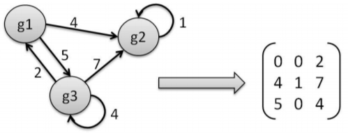
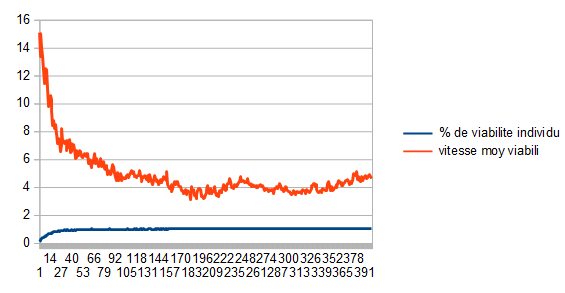
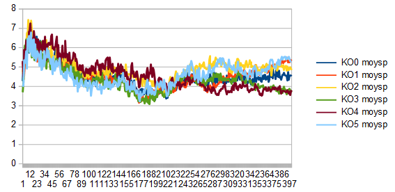
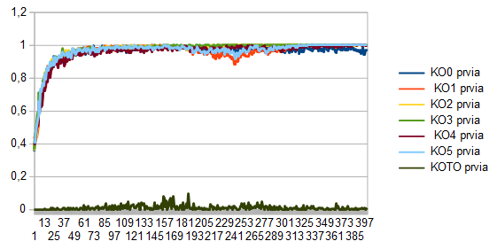
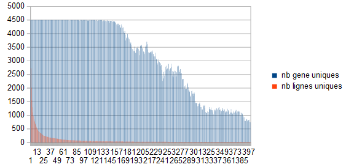

#UE Projet
Simulation of evolution, gene regulation network. Each individual is represented by its gene regulation network, a square matrix.
Rows of the matrix represents regulations of genes, columns regulations that a gene do to the others.
A gene is defined by the combination of a rows and columns (from the diagonal)

##Principles
- Regulation network:
    
    - Each line corresponds to a gene, with the regulations that it receives, the sum of the line is the expression level of the gene
    - Each columns represents regulations a gene do to the others
    - Each coefficient is from the normal law, average 0 and variance 1. So they can be negative
- Viability:
    The genotype is represented by a matrix, and the phenotype by a vector, full of 1 for the first iteration.
    Then of matrix product is done between the matrix and vector, the resultant vector is simplified between positive values, as +1, and negatives ones, -1.
    The individual is viable if at a moment, after some iteration, 2 identical phenotypes are obtained consecutively
    So from always the same phenotype, there is different resulting phenotypes among the population
- Reproduction:
    From two matrix, "parents", random rows(genes) are picked to form the new individual
    Rows conserve their position!
- Mutations:
    Mutation can be applied when a new individual is created.
    They are controlled by a probability and a max number of simultaneous mutation
- KO:
    For "knock out", i.e for an element of the matrix, the associated line and column are set to zero.
    Unlike mutations, KO are not saved in the genotype, it is just as resistance test
    - KO_0: On random gene
    - KO_1: By coordinates, gene 1 by default
    - KO_2: On the more expressed gene, i.e the line with the biggest sum
    - KO_3: On the less expressed gene
    - KO_4: On the gene regulating the more the others, i.e the column with the biggest sum
    - KO_5: On the gene regulating the less, even negatively
    - KO_TO: All the positions are tested for KO resistance, the individuals are stated viable if and only if they resists to all KO (one by one)

#Inputs
- **Number of generations:** Number of iteration before the program ends
- **Population size:** Number of individuals to be generated at each
generation
- **Genotype size:** Correspond to the square matrix size
- **Mutation probability** Actually, 0.99 is equivalent to 1%
- **KO probability**
- **Max number of mutation per individuals**
- **Recording step:** Append a line in the output each n generations

#Output
CSV file, with each line corresponding to a generation, and with columns:

- `% de viabilite individu` : Represent the % of non viable matrix
in the new generation: rejected / (rejected+admitted)

- `vitesse moy viabili`: Number of necessary loop turn needed to assert
that a matrix is viable.

- `KO moysp`: Same as `% de viabilite individu`, but for a generation that has suffer of KOs

- `koprvia`: Same as `vitesse moy viabili`, but for a generation that has suffer of KOs

- `nb lignes uniques`: Count, for the whole generation, how many unique matrix rows there is, e.g if the same line is present 10 times among the individuals of the whole generation, it will be counted as one.
- `nb genes uniques`: Count, for the whole generation, how many unique matrix rows and columns combination from the diagonal there is

#Issues
##IntelliJ error
- Be sure to have ``"Inherit project compile output path"`` either class
arent found

##Known issues
- The `scanner` (keystroke recording) has a bug with  `exeprj1.jar`,
so edit the parameters in ``ClassePRJmain.java`` and run from sources

##TODO
- [ ] Fancier probability input
- [ ] Multithreading
- [ ] Create of second branch
- [ ] Other methods to identify a row/gene (hash, mem addr..)
- [ ] Create a phenotype object?
- [ ] Create a config file, or commandline arguments, with help

